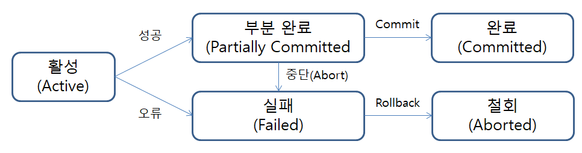

📖 데이터베이스론
=============
# CHAPTER 14. 인덱싱 , 트렌젝션

## 인덱스 방법
    인덱스 방법(indexed method)은 기본적으로 데이터 레코드를 접근하기 위해서
    먼저 해당 인덱스(index)를찾아서 그 인덱스가 가리키는 주소를 따라가 원하는
    레코드를 접근할 수 있도록 데이터를 저장하는 방법이다.

    컬럼의 값과 해당 레코드가 저장된 주소를 키와 값의 쌍으로 인덱스를 만들어 두는 것이다.

### Primary index (기본 인덱스)
    기본 키를 포함하고 있는 인덱스를 primary index라고 한다.
### Secondary index (보조 인덱스)
    기본 인덱스 이외의 인덱스들을 secondary index라고 한다.
    보조 인덱스는 보통 보조키를 포함하도록 구성된다.

### clustered index (집중 인덱스)
    클러스터(Cluster)란 여러 개를 하나로 묶는다는 의미로 주로 사용되는데, 클러스터드 인덱스도 크게 다르지 않다. 인덱스에서 클러스터드는 비슷한 것들을 묶어서 저장하는 형태로 구현되는데, 이는 주로 비슷한 값들을 동시에 조회하는 경우가 많다는 점에서 착안된 것이다. 여기서 비슷한 값들은 물리적으로 인접한 장소에 저장되어 있는 데이터들을 말한다.

### unclustered index (비집중 인덱스)

    집중 형태가 아닌 인덱스를 unclustered index라고한다.
    비집중 인덱스는 하나의 데이터에 대해 여러 개가 만들어 질 수 있다.

## B트리 인덱스와 해싱 인덱스

#### B트리 인덱스

    B-Tree 알고리즘은 가장 일반적으로 사용되는 인덱스 알고리즘이다.
    B-Tree 인덱스는 칼럼의 값을 변형하지 않고, 원래의 값을 이용해 인덱싱하는
    알고리즘이다.

#### Hash 인덱스

    Hash 인덱스 알고리즘은 컬럼의 값으로 해시 값을 계산해서 인덱싱하는 알고리즘으로, 매우 빠른 검색을 지원한다. 하지만 값을 변형해서 인덱싱하므로, 전방(Prefix) 일치와 같이 값의 일부만 검색하고자 할 때는 해시 인덱스를 사용할 수 없다. Hash 인덱스는 주로 메모리 기반의 데이터베이스에서 많이 사용한다.

-----------------------------------------------
# 트랜잭션

## 트랜잭션

### 트랜잭션이란?

    트랜잭션(Transaction)은 데이터베이스의 상태를 변환시키는 하나의 논리적 기능을 수행하기 위한 작업의 단위 또는 한꺼번에 모두 수행되어야 할 일련의 연산들을 의미한다.

### 트랜잭션의 특성 (ACID)

    A. 원자성   (atomicity)
    트랜잭션은 자기의 연산을 전부 실행하냐 전무   
    실행하냐만 가능하다.

    C. 일관성   (consistency)
    트랜잭션이 그 실행을 성공적으로 완료하면 언제나 일관성 있는 데이터베이스 상태로 변환한다. 즉 트랜잭션 실행의 결과로 데이터베이스 상태가 모순되지 않는다.
    
    I. 격리성   (isolation)
    둘 이상의 트랜잭션이 동시에 병행 실행되고 있을 경우에 어느 하나의 트랜잭션이라도 다른 트랜잭션의 연산을 끼어들 수 없다.  

    D. 영속성   (durability)
    트랜잭션이 일단 그 실행을 성공적으로 완료하면 그 결과는 영속적이다. 성공적으로 수행된 트랜잭션은 영구적으로 반영되어야 한다.

### 트랜잭션 상태

#### 데이터베이스를 접근하여 갱신 연산을 수행하는 트랜잭션은 다음과 같은 다섯가지 상태중 어느 하나에 속하게 된다.

    1. 활동  (active)
    트랜잭션이 실행을 시작하였거나 실행 중인 상태

    2. 부분 완료 (partiallly committed) 
    트랜잭션이 마지막 명령문을 실행한 직후의 상태

    3. 실패(failed)
    정상적 실행을 더 이상 계속 할 수가 없어서 중단한 상태
    
    4. 철회(aborted)
    트랜잭션이 실행에 실패하여 Rollback 연산을 수행한상태

    5. 완료(committed)
    트랜잭션이 실행을 성공적으로 완료하여 Commit 연산을 수행한 상태
    
트랜잭션이 종료 될 때는 반드시 Commit 연산을 하거나 Rollback 연산을 수행해야 한다.

--------------------------------------

이석호, 『데이타베이스론』, 정익사(2010)